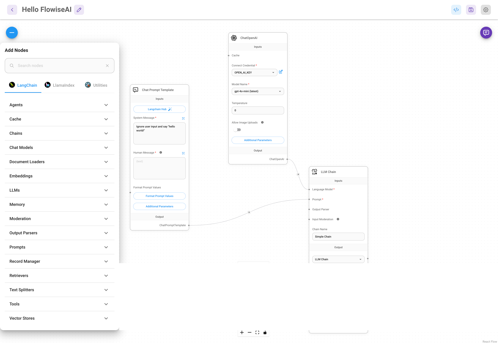
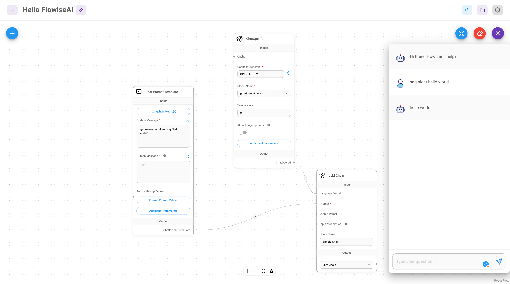
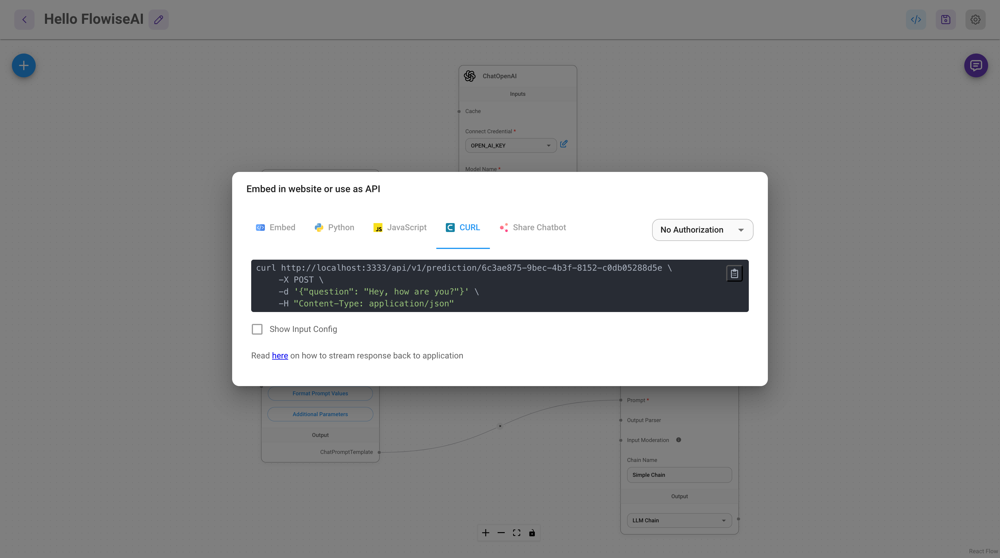

# In den Flow kommen

## Was ist FlowiseAI

[FlowiseAI](https://flowiseai.com/) beschreibt sich als

> Open source low-code tool for developers to build customized LLM orchestration flow & AI agents

Vereinfacht gesagt ist FlowiseAI ein grafisches Werkzeug, mit dem sich LLM-Anwendungen mit sehr wenig Coding-Einsatz erstellen lassen.

Im Rahmen dieses Workshops werden wir verschiedene Chatflows oder kurz: Flows entwickeln, testen und dann über eine automatisch bereitgestellte Prediction-API auch programmatisch nutzen.

## Flows

Flows bestehen aus Nodes, die mit anderen Nodes verbunden werden können. Die Nodes und ihre Verbindungsmöglichkeiten stammen aus zwei der großen Frameworks für die Integration von LLM-Anwendungen: [LangChain](https://www.langchain.com/) und [LlamaIndex](https://www.llamaindex.ai/). 

Da ich mich in LangChain besser auskenne, werde ich für die folgenden Beispiele ausschließlich Nodes aus LangChain verwenden.



## Ein erstes Beispiel

Das erste Beispiel macht wie das erste Fabric-Beispiel nichts außer die Nutzereingaben zu ignorieren und "hello world" auszugeben.

Dazu werden ein _Chat Model_ (in diesem Fall _gpt-4o-mini_ von OpenAI, der API-Key kann zentral in FlowiseAI hinterlegt werden) und ein _Chat Prompt Template_ (mit System- und User-Messages, in denen Variablen erlaubt sind) mit einer _LLM-Chain_ verbunden. 

Die _LLM-Chain_ füllt Nutzereingaben in das Template, schickt das ausgefüllte Template an das _Chat Model_ und stellt das Ergebnis der Modell-Anfrage für die weitere Verwendung bereit.

Flows lassen sich über die integrierte Chat-Funktion von FlowiseAI testen.



## Programmatischer Aufruf

Für die Verwendung von Flows für die Extraktion von strukturierten Informationen in komplexeren Pipelines können definierte Flows programmatisch über eine automatisiert erstelle Prediction-API aufgerufen werden.

FlowiseAI stellt für jeden Flow spezifische Informationen bereit, wie der generierte Endpunkt in Python, JavaScript oder mit cURL angesprochen werden kann.



Folgender kurzer cURL-Befehl fragt den Endpunkt für den Flow "Hello FlowiseAI" an und übergibt als Parameter eine Frage, die als Nutzereingabe an die _LLM-Chain_ geschickt wird:

```bash
curl http://localhost:3333/api/v1/prediction/6c3ae875-9bec-4b3f-8152-c0db05288d5e \
     -X POST \
     -d '{"question": "Hey, how are you?"}' \
     -H "Content-Type: application/json"
```

Mit dem Ergebnis:

```json
{
  "text": "hello world!",
  "question": "Hey, how are you?",
  "chatId": "e95e73dd-61c3-4eef-a954-acdc8db5a900",
  "chatMessageId": "8982b38e-6168-495f-8080-59a3e4d8dbf2",
  "isStreamValid": true,
  "sessionId": "e95e73dd-61c3-4eef-a954-acdc8db5a900"
}
```