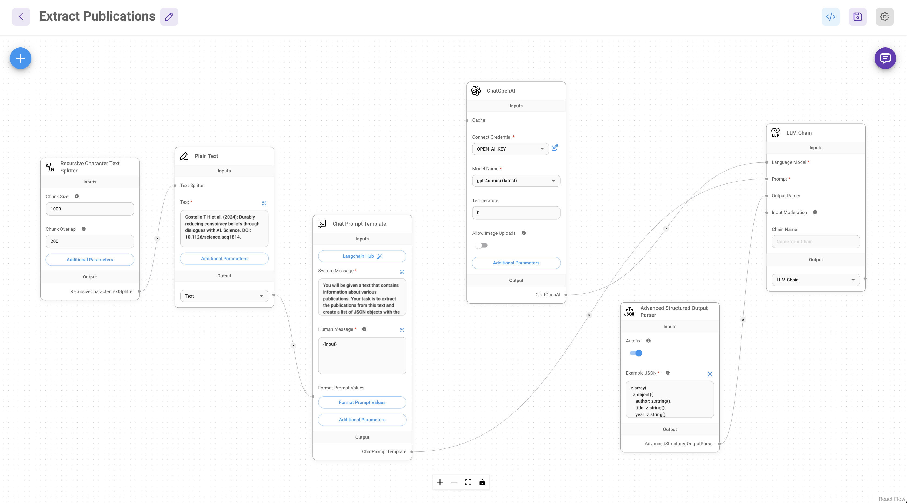
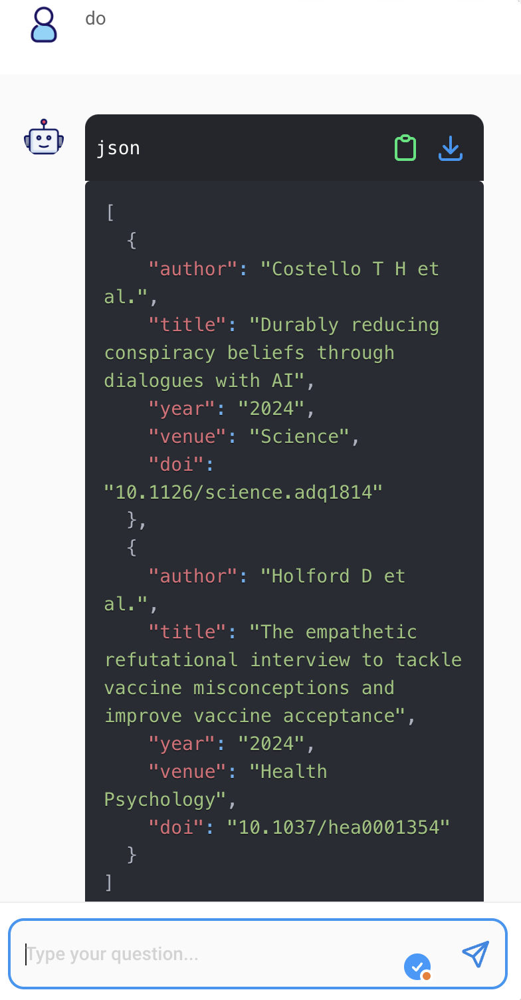

# Publikationen mit FlowiseAI extrahieren

Als nächstes Experiment übertragen wir das Fabric-Beispiel der Extraktion von Publikationsdaten in FlowiseAI. Dabei nutzen wir die Möglichkeit, unsere Ausgabe von einem _Advanced Output Parser_ gegen ein Schema validieren zu lassen.

## Der Flow



Die Eingabe der Textdaten, aus denen Publikationen extrahiert werden können, geschieht über eine _Plain Text_-Node, die eine Variable _input_ in einem _Chat Prompt Template_ speist. In der _System Message_ des _Chat Prompt Template_ stehen die genauen Anweisungen zur Extraktion von Publikationsdaten aus dem _custom pattern_ für Fabric.

Eine _LLM Chain_ verbindet dieses Template mit einem Sprachmodell (_gpt-4o-mini_) und einem _Advanced Structured Output Parser_, der die Textdaten aus der Rückgabe des Sprachmodells in JSON parst und gegen ein vorgegebenes Schema validiert.

Das Schema lässt sich über [Zod](https://zod.dev/) definieren. Mit folgendem [Tool](https://transform.tools/json-to-zod) lassen sich Zod-Schemata aus JSON-Beispielen erzeugen.

Das Schema für unser Beispiel legt fest, dass wir eine Liste von JSON-Objekten mit den Feldern "author", "title", "year" , "venue" und "doi" erwarten und dass die Werte für alle Felder Strings sind.

```TypeScript
z.array(
  z.object({
    author: z.string(),
    title: z.string(),
    year: z.string(),
    venue: z.string(),
    doi: z.string()
  })
)
```

Mit der Chat-Funktion in FlowiseAI kann der Flow mit einer beliebigen Anweisung, bspw. "Do", getestet werden: Die Publikationen aus den Beispieldaten im Textfeld werden erfolgreich extrahiert!



## Programmatischer Aufruf

Die für unseren Flow automatisiert erzeugte Prediction-API kann wie folgt via cURL aufgerufen werden:

```bash
curl http://localhost:3333/api/v1/prediction/7b76d958-ccdc-472d-aa51-b4f0f8c7f651 \
     -X POST \
     -d '{"question": "Hey, how are you?"}' \
     -H "Content-Type: application/json"
```

Das Ergebnis sind die Publikationen, die aus dem Beispiel in dem im Flow definierten Textelement extrahiert werden:

```json
{
  "json": [
    {
      "author": "Costello T H et al.",
      "title": "Durably reducing conspiracy beliefs through dialogues with AI",
      "year": "2024",
      "venue": "Science",
      "doi": "10.1126/science.adq1814"
    },
    {
      "author": "Holford D et al.",
      "title": "The empathetic refutational interview to tackle vaccine misconceptions and improve vaccine acceptance",
      "year": "2024",
      "venue": "Health Psychology",
      "doi": "10.1037/hea0001354"
    }
  ],
  "question": "Hey, how are you?",
  "chatId": "7e2b5ab8-6b95-438e-a3da-ed4c465b69af",
  "chatMessageId": "f0fe176d-0517-4aee-94df-38c20fd611b0",
  "isStreamValid": false,
  "sessionId": "7e2b5ab8-6b95-438e-a3da-ed4c465b69af"
}

```

### Wie überschreiben wir die Daten für das Textfeld?

Mit dem Parameter _overrideConfig_ können Variablen in Flows überschrieben werden. Im folgenden Beispiel überschreiben wir die Publikationen, die in dem Textfeld im Flow stehen:

```bash
curl http://localhost:3333/api/v1/prediction/7b76d958-ccdc-472d-aa51-b4f0f8c7f651 \
     -X POST \
     -d '{"question": "Do!", "overrideConfig": {"text": "[5] Johnson A et al. (2024): Inoculation hesitancy: an exploration of challenges in scaling inoculation theory. Royal Society Open Science. DOI: 10.1098/rsos.231711. \n [6] Schekman R (2013): How journals like Nature, Cell and Science are damaging science. Guardian. Zeitungsartikel."}}' \
     -H "Content-Type: application/json"
```

```json
{
  "json": [
    {
      "author": "Johnson A et al.",
      "title": "Inoculation hesitancy: an exploration of challenges in scaling inoculation theory",
      "year": "2024",
      "venue": "Royal Society Open Science",
      "doi": "10.1098/rsos.231711"
    },
    {
      "author": "Schekman R",
      "title": "How journals like Nature, Cell and Science are damaging science",
      "year": "2013",
      "venue": "Guardian",
      "doi": "N/A"
    }
  ],
  "question": "Do!",
  "chatId": "d9f3dd21-5452-4e61-bde4-2332bfb1e226",
  "chatMessageId": "b3867dd4-38de-4a61-b7bc-cbd0d0c2f2d0",
  "isStreamValid": false,
  "sessionId": "d9f3dd21-5452-4e61-bde4-2332bfb1e226"
}
```

### Wie bekommt man Daten dynamisch an die API?

Das ist schon ganz nett, aber _wirklich_ hilfreich wäre eine Möglichkeit, beliebige Inhalte über das Pipe-Element an die Prediction-API geben zu können. Das lässt sich sauber über sogenante _heredocs_ und eine _command substitution_ von ```cat /dev/stdin```erreichen:

```bash
cat data/smc_angebot.txt | curl http://localhost:3333/api/v1/prediction/7b76d958-ccdc-472d-aa51-b4f0f8c7f651 \
     -X POST \
     -H "Content-Type: application/json" \
     -d @- << EOF
{
  "question": "Do!",
  "overrideConfig": {
    "text": "$(cat /dev/stdin)"
  }
}
EOF
```

Das ist natürlich etwas wild, um es jedesmal zu tippen, aber man kann den rechten Teil der Pipe einfach in ein kleines Shell-Skript verpacken:

```bash
cat data/smc_angebot.txt | sh examples/flowise/scripts/extract_publications.sh 
```

(und natürlich wäre hier auch ein kleines Python-Skript für Integration der FlowiseAI-API möglich …)

FlowiseAI liefert das Ergebnis, das uns interessiert unter dem Schlüssel "json" zurück. Mit _jq_ können wir dieses Feld direkt extrahieren und von den Status-Meldungen der FlowiseAI-API trennen:

```bash
cat data/smc_angebot.txt | sh examples/flowise/scripts/extract_publications.sh  | jq '.json'
```
Et voilà: wir rufen mit unseren Textdaten einen _entkoppelten_ Flow in FlowiseAI auf und können die Ergebnisse beliebig weiterverarbeiten.

```json
[
  {
    "author": "Costello T H et al.",
    "title": "Durably reducing conspiracy beliefs through dialogues with AI",
    "year": "2024",
    "venue": "Science",
    "doi": "10.1126/science.adq1814"
  },
  {
    "author": "Holford D et al.",
    "title": "The empathetic refutational interview to tackle vaccine misconceptions and improve vaccine acceptance",
    "year": "2024",
    "venue": "Health Psychology",
    "doi": "10.1037/hea0001354"
  },
  {
    "author": "Ayers J W et al.",
    "title": "Comparing physician and artificial intelligence chatbot responses to patient questions posted to a public social media forum",
    "year": "2023",
    "venue": "JAMA Internal Medicine",
    "doi": "10.1001/jamainternmed.2023.1838"
  },
  {
    "author": "Altay S et al.",
    "title": "Scaling up interactive argumentation by providing counterarguments with a chatbot",
    "year": "2022",
    "venue": "Nature Human Behavior",
    "doi": "10.1038/s41562-021-01271-w"
  },
  {
    "author": "Kozyreva A et al.",
    "title": "Toolbox of individual-level interventions against online misinformation",
    "year": "2024",
    "venue": "Nature Human Behaviour",
    "doi": "10.1038/s41562-024-01881-0"
  },
  {
    "author": "Johnson A et al.",
    "title": "Inoculation hesitancy: an exploration of challenges in scaling inoculation theory",
    "year": "2024",
    "venue": "Royal Society Open Science",
    "doi": "10.1098/rsos.231711"
  },
  {
    "author": "Schekman R",
    "title": "How journals like Nature, Cell and Science are damaging science",
    "year": "2013",
    "venue": "Guardian",
    "doi": "N/A"
  }
]
```