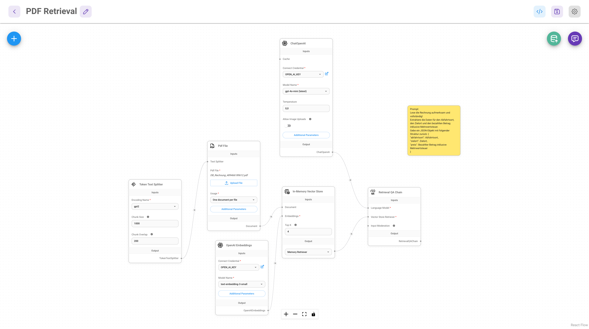

# Daten aus PDF auslesen

Die Extraktion von Informationen aus PDF-Dateien ist ein häufiger Anwendungsfall in der Aufbereitung von Daten für die Analyse. Die LangChain-Integration in FlowiseAI stellt unterschiedliche _document loader_ bereit, so auch einen für PDF-Dateien.

## Flow



Der Flow ist etwas komplizierter, weil die PDF-Datei einer gewissen Vorverarbeitung bedarf.

Die PDF-Datei wird geladen, in eine Textform überführt und in Chunks aufgeteilt. Für diese Chunks wird mit _text-embedding-3-small_-Modell von OpenAI ein Embedding berechnet. Embeddings und Textinhalte der Chunks werden in einen _In-Memory Vector Store_ geladen.

Dieser _Vector Store_ kann von einer _Retrieval QA Chain_ über einen _Vector Store Retriever_ angefragt werden, der für eine Query (bzw. deren Embedding) passende Chunks der PDF-Datei (über deren Embeddings) findet. Ein mit der _Retreival QA Chain_ verbundenes Sprachmodell dafür zu zuständig, anhand der ermittelten Chunks eine Antwort auf die gestellte Frage zu generieren.

Als Testaufbau habe ich eine Rechnung der DB hochgeladen. Im Flowise-Chat kann ich nun nach strukturierten Informationen zur Rechnung (Abfahrts- und Zielort, Preis) fragen.


## Programmatischer Aufruf

Interessant (und etwas herausfordernd) ist wieder die Frage, wie wir den Flow "PDF Retrieval" für beliebige DB-Rechnungen aufrufen können.

Eine bestimmte Datei lässt sich wie folgt an cURL und damit an die Prediction-API für den Flow übergeben:

```bash
curl http://localhost:3333/api/v1/prediction/9c527c0e-d6eb-4cf8-a7aa-a5a7a34a0b44 \
     -X POST \
     -F'question="Lese die Rechnung aufmerksam und vollständig!
Extrahiere die Daten für den Abfahrtsort, den Zielort und den bezahlten Betrag inklusive Mehrwertsteuer.
Gebe ein JSON-Objekt mit folgender Struktur zurück: {
\"abfahrtsort\": Abfahrtsort,
\"zielort\": Zielort,
\"preis\": Bezahlter Betrag inklusive Mehrwertsteuer
}"' \
     -F "files=@/Users/mbittkowski/Downloads/DB_Rechnung_121649591420.pdf" \
     -H "Content-Type: multipart/form-data"
```

Aus diesem konkreten Beispiel lässt sich leicht ein Shell-Skript schreiben, das den Pfad zur zu benutzenden PDF-Datei als Parameter übergeben bekommt. (Die Nachbearbeitung des Ergebnisses mit _jq_ können wir auch gleich in dieses Skript einbauen.)

```bash
if [ "$#" -ne 1 ]; then
    echo "Usage: $0 <path_to_pdf_file>"
    exit 1
fi

pdf_file="$1"

curl -s http://localhost:3333/api/v1/prediction/9c527c0e-d6eb-4cf8-a7aa-a5a7a34a0b44 \
     -X POST \
     -F 'question=Lese die Rechnung aufmerksam und vollständig!
Extrahiere die Daten für den Abfahrtsort, den Zielort und den bezahlten Betrag inklusive Mehrwertsteuer.
Gebe ein JSON-Objekt mit folgender Struktur zurück: {
"abfahrtsort": Abfahrtsort,
"zielort": Zielort,
"preis": Bezahlter Betrag inklusive Mehrwertsteuer
}' \
     -F "files=@$pdf_file" \
     -H "Content-Type: multipart/form-data" | jq ".text" | jq -r
```

Beispiel: ```sh examples/flowise/scripts/scrape_db_rechnung.sh ~/Downloads/DB_Rechnung_121649591420.pdf ```

```json
{
  "abfahrtsort": "Tübingen Hbf",
  "zielort": "Köln Hbf",
  "preis": 77.95
}
```