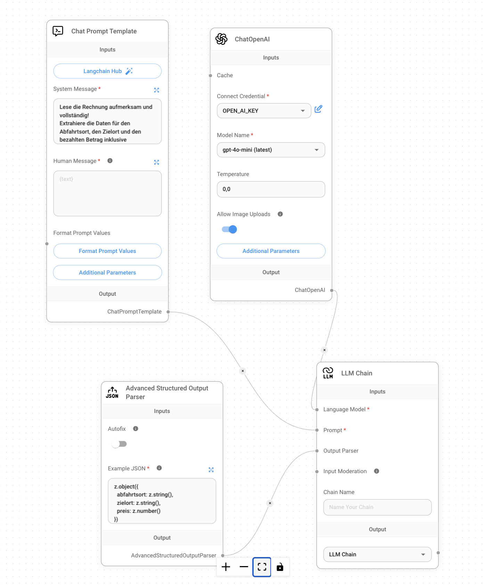
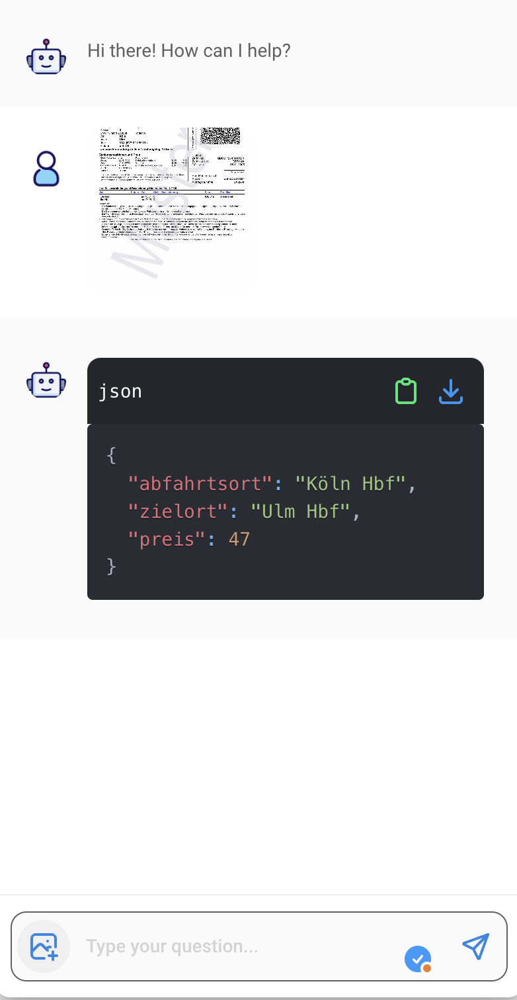

# Strukturierte Daten aus Bildern extrahieren

Neuere multimodale Sprachmodelle bieten die Möglichkeit, Informationen direkt aus Bildaten zu extrahieren. Das ist praktisch, wenn bspw. in einer PDF-Datei keine Textdaten hinterlegt sind, sondern Bilder von Scans.

Für dieses Beispiel extrahieren wir Daten aus einem Bild eines Online-Tickets der DB.

## Flow



Der Flow ist zum Großteil wie unser erstes FlowiseAI-Beispiel aufgebaut. Eine _LLM-Chain_ verknüpft ein _Chat Prompt Template_ und ein _Chat Model_, dazu kommt noch ein _Advanced Structured Output Parser_ der das Ergebnis in JSON überführt und gegen das gewünschte Schema validiert.

Der wirklich entscheidende Unterschied ist, dass der Toggle _Allow Image Upload_ aktiviert wurde.

Damit können im FlowiseAI-Chat Bilder an die LLM-Chain gesendet werden, um gemäß des im _Chat Prompt Template_ definierten Prompts verarbeitet zu werden.



## Programmatischer Aufruf

Der programmatische Aufruf des Prediction-Endpunkts für den Flow ist etwas komplizierter, weil die binären Bilddaten zunächst in einene _base64_-enkodierten String übersetzt werden müssen. 

Folgendes Shell-Skript übernimmt diese Vorarbeiten und sendet das enkodierte Bild mit den korrekten Metadaten an die FlowiseAI-API:

```bash
if [ "$#" -ne 1 ]; then
    echo "Usage: $0 <path_to_image_file>"
    exit 1
fi

image_path="$1"
image_name=$(basename "$image_path")
mime_type=$(file -b --mime-type "$image_path")

# Convert image to base64
image=$(base64 -i "$image_path")

(curl -s http://localhost:3333/api/v1/prediction/16b1492d-08e8-4484-8590-551a786e1045 \
     -X POST \
     -H "Content-Type: application/json" \
     -d @- << EOF
{
    "question": "Do",
    "uploads": [
        {
            "data": "data:${mime_type};base64,${image}",
            "type": "file",
            "name": "${image_name}",
            "mime": "${mime_type}"
        }
    ]
}
EOF
) | jq '.json'

```

Beispiel:

```bash
sh examples/flowise/scripts/scrape_db_ticket_multimodal.sh data/wikipedia_OnlineTicket_DeutscheBahn_200dpi.png
```

Ergebnis:

```json
{
  "abfahrtsort": "Köln Hbf",
  "zielort": "Ulm Hbf",
  "preis": 47
}
```